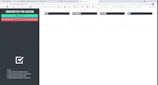

# Task Master Pro

## Table of Contents
* [Deployed](#deployed)
* [Description](#description)
* [Technologies](#technologies)
* [Usage](#usage)
* [Preview](#preview)
* [Questions](#questions)
* [Credits](#credits)

## Deployed
Access the website at https://sarawrmas.github.io/taskmaster/

## Description
Task Master Pro is the new pro edition of Taskinator. This new update features a clean interface for an improved user experience and draggable functionality to update tasks.

## Technologies
* HTML
* CSS
* Bootstrap
* JavaScript
* jQuery

## Usage
Select "Add Task" from the left viewer pane. A modal will pop up where you can enter a task description and select a due date from the calendar. Select "Save Task" to save the task or "Close" to cancel the action.

Tasks that are due in the next 3 days will appear yellow. Tasks that are in the past will appear red. All other tasks will appear in white.

Tasks will automatically appear in the "To Do" box. To update the task's status, click and drag the task to a new status box.

To sort tasks in a list, click and drag to move them into your desired order.

To edit a task's text, click on the task body and it will turn into a textbox. From here, enter new task text and click outside of the box to save. To edit the due date, click on the existing date and the calendar will pop back up. Select new date and changes will be applied.

To delete one task, click and drag it out of place and a red trash bin will appear at the bottom of the screen. Drag the task into the trash bin and your task will be deleted.

To delete all tasks, select "Delete All Tasks" from the left-hand menu.

## Preview

## Questions
Have questions about this project?  
GitHub: https://github.com/sarawrmas  
Email: sara.m.adamski@gmail.com

## Credits
Sara Adamski  
Icons from flaticon.com
